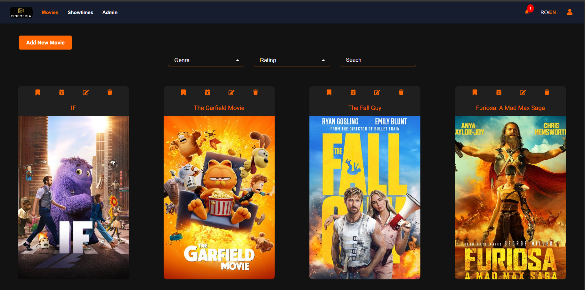
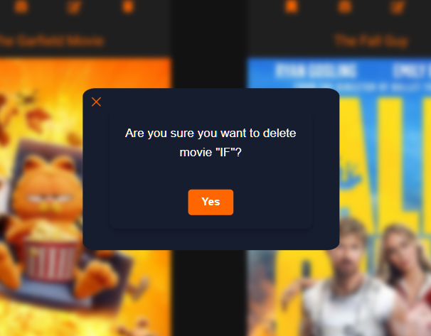
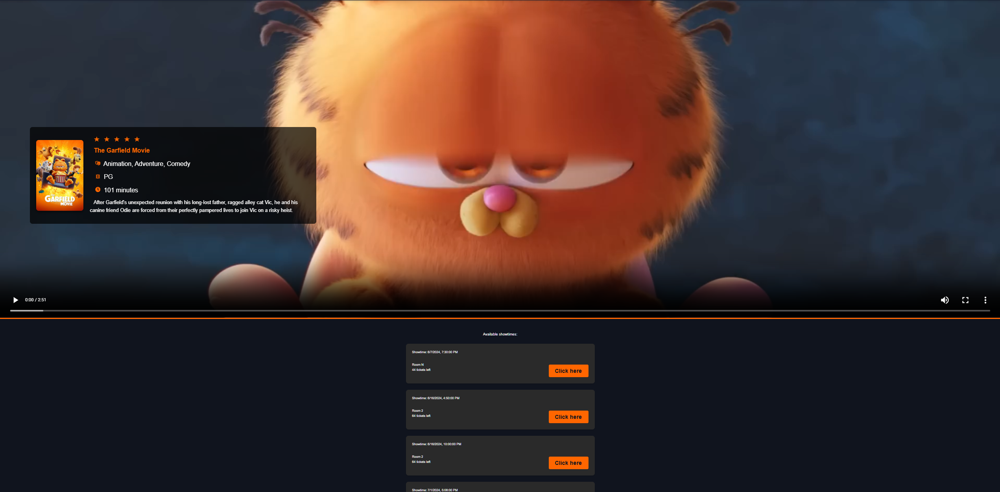
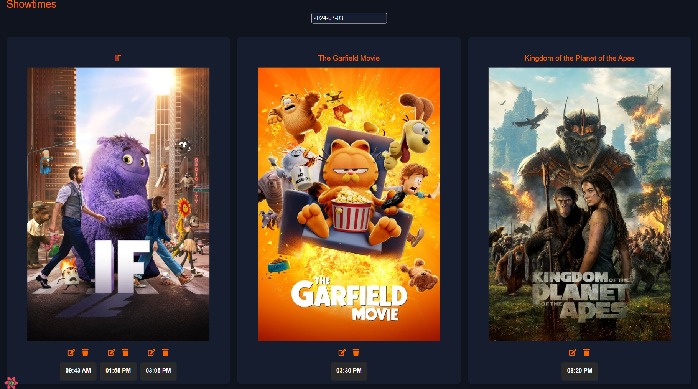
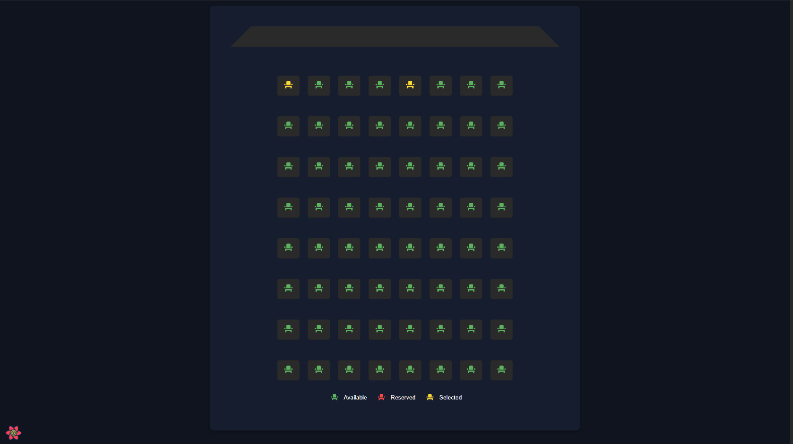
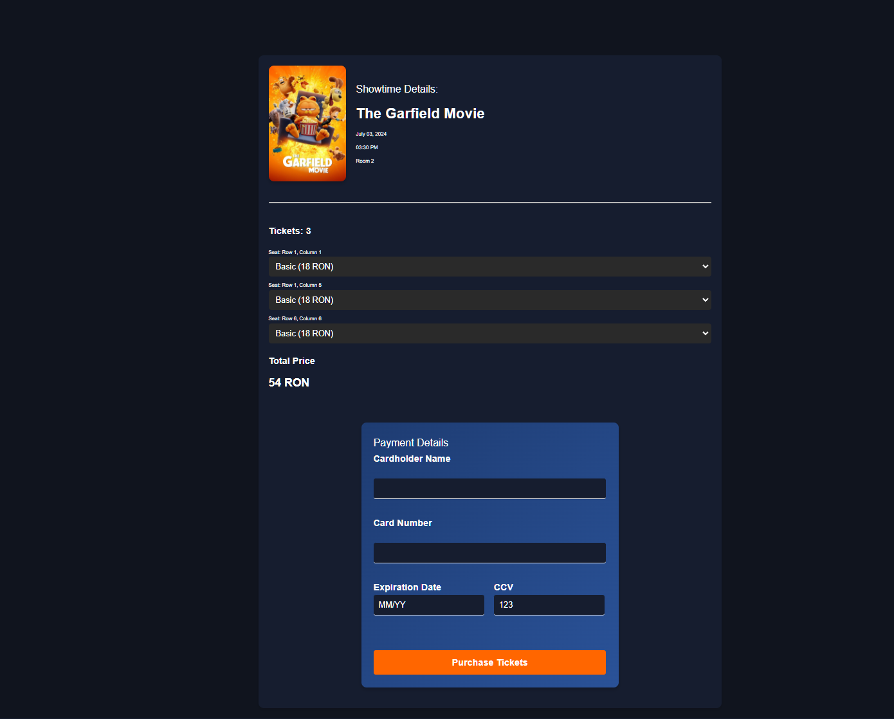
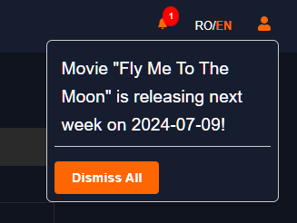
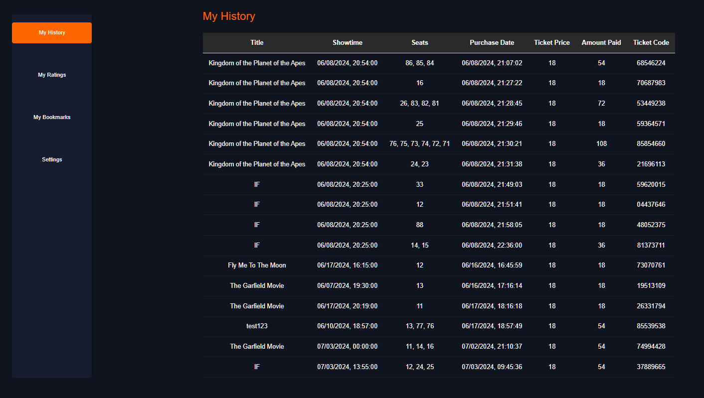

# cinema-project

An application created with MERN Stack (MongoDB, Express, React and Node) and AWS S3 to manage a cinema

## Pictures

* Main Page

* Highly reusable modal

* Movies' page

* Showtimes Page

* Seats overview

* Payment

* Notifications

* User Profile

## Features

* User Authentication: Users can sign up, log in, and log out.
* Movie Management: Admins can add, delete, and update movie details.
* Showtime Management: Admins can create and manage showtimes.
* Ticket Booking: Users can book tickets for available showtimes.
* User Profiles: Users can view and update their profiles, including their booking history.
* Notifications: Users receive notifications for various actions such as booking confirmations.
* Bookmarks: Users can bookmark their favorite movies.

## Tehnologies Used

### Frontend
React, CSS, React Query, React Router, React Hot Toast, React Icons, Fetch API

### Backend 
Node.js, Express.js, Multer, MongoDB, Mongoose, Passport.js

### Others
AWS S3 for storing movie posters and trailers, Nodemailer for sending emails, cron jobs for scheduled tasks

## Project Structure
* /config: Contains configuration files such as cron jobs and database connection.
* /controllers: Contains the logic for handling various routes and operations.
* /models: Contains Mongoose models for MongoDB collections.
* /routes: Contains route definitions for movies, showtimes, rooms, and users.
* /middleware: Contains middleware functions for authentication and authorization.
* /client: Contains the React frontend application.

## Installation

### Prerequisites
* Node.js
* MongoDB
* AWS S3
* Gmail account

### Steps
Will soon